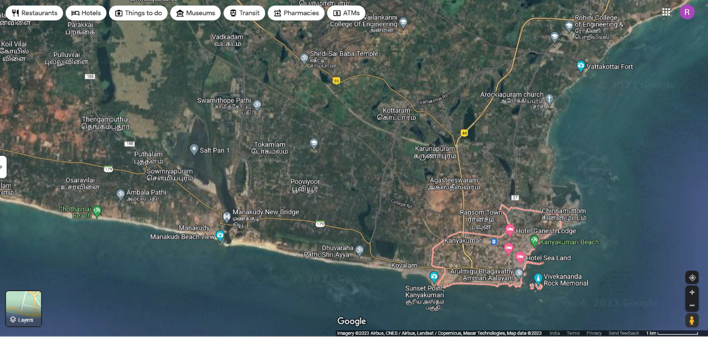
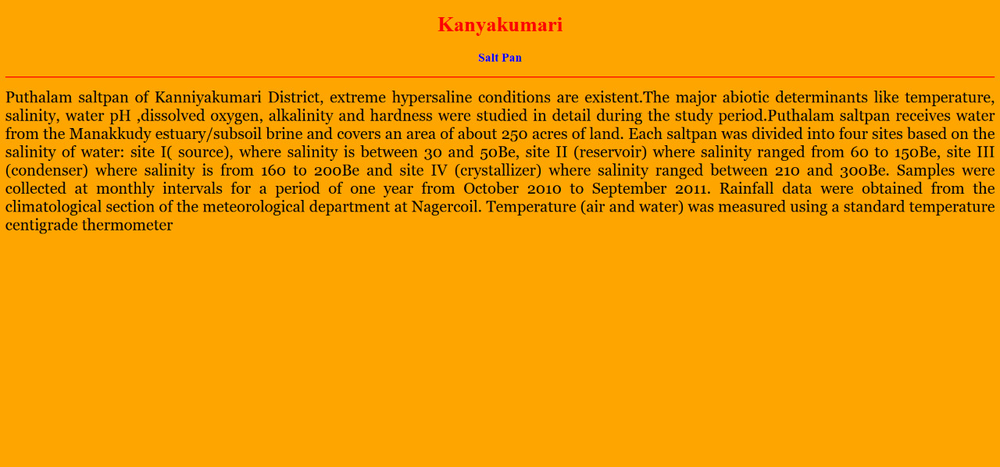
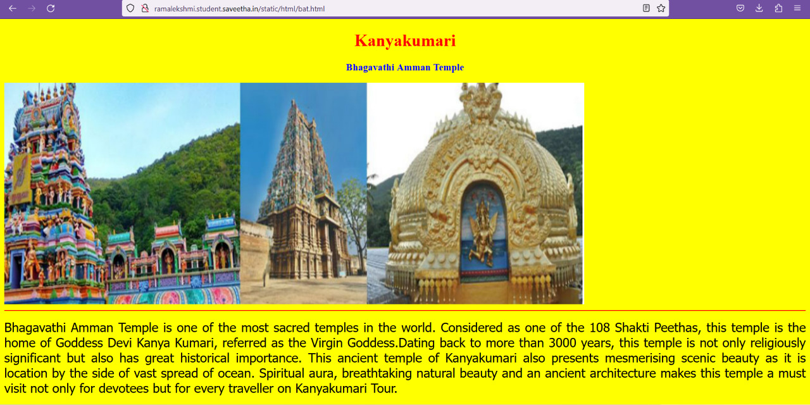
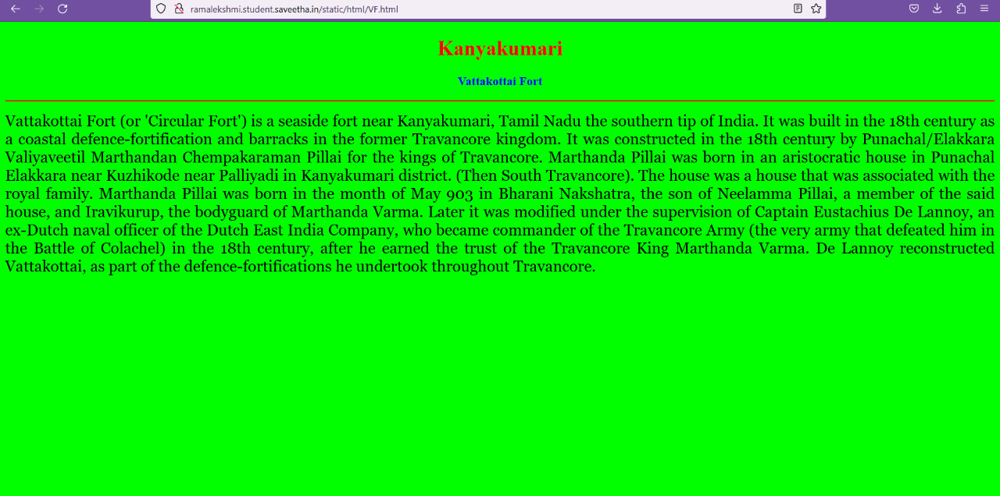
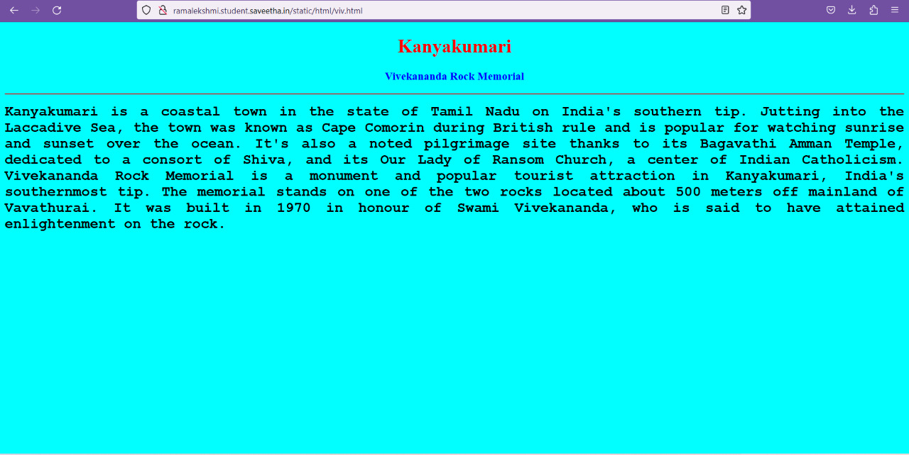
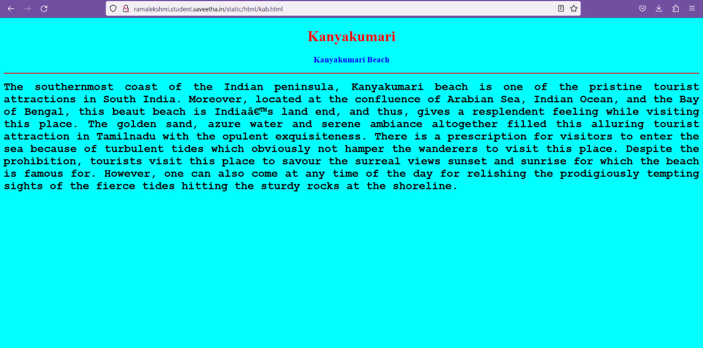

# Places Around Me
## AIM:
To develop a website to display details about the places around my house.

## Design Steps:

### Step 1:
   Do the reqired functions in theia id.
### Step 2:
   type the html code and run the server.
## Code:
```python
map.html

<!DOCTYPE html>
<html lang="en">
<head>
<title>My City</title>
</head>
<body>
<h1 align="center">
<font color="red"><b>KANYAKUMARI</b></font>
</h1>
<h3 align="center">
<font color="blue"><b>Rama E.K. Lekshmi(22009028)</b></font>
</h3>
<center>

<map name="MyCity">
<area shape="circle" coords="1447,757,1447,757" href="/static/html/vrm.html" title="Vivekananda Rock Memorial">
<area shape="rectangle" coords="1172,745,1172,747"  href="/static/html/bat.html" title="Bhagavathi Amman Temple">
<area shape="circle" coords="1439,645,1439,645" href="/static/html/kb.html" title="Kanyakumari Beach>
<area shape="circle" coords="1563,179" href="/static/html/fort.html" title="Vattakottai Fort">
<area shape="circle" coords="529,400,529,400"  href="/static/html/pan.html" title="Salt Pan">

</map>
</center>
</body>
</html>


vrm.html

<!DOCTYPE html>
<html lang="en">
<head>
<title>Vivekananda Rock Memorial</title>
</head>
<body bgcolor="cyan">
<h1 align="center">
<font color="red"><b>Kanyakumari</b></font>
</h1>
<h3 align="center">
<font color="blue"><b>Vivekananda Rock Memorial</b></font>
</h3>
<hr size="3" color="red">
<p align="justify">
<font face="Courier New" size="5">
<b>
Kanyakumari is a coastal town in the state of Tamil Nadu on India's southern tip. Jutting into the Laccadive Sea, the town was known as Cape Comorin during British rule and is popular for watching sunrise and sunset over the ocean. It's also a noted pilgrimage site thanks to its Bagavathi Amman Temple, dedicated to a consort of Shiva, and its Our Lady of Ransom Church, a center of Indian Catholicism.
Vivekananda Rock Memorial is a monument and popular tourist attraction in Kanyakumari, India's southernmost tip. The memorial stands on one of the two rocks located about 500 meters off mainland of Vavathurai. It was built in 1970 in honour of Swami Vivekananda, who is said to have attained enlightenment on the rock.
</b>
</font>
</p>
</body>
</html>

bat.html

<!DOCTYPE html>
<html lang="en">
<head>
<title>Bhagavathi Amman Temple</title>
</head>
<body bgcolor="yellow">
<h1 align="center">
<font color="red"><b>Kanyakumari</b></font>
</h1>
<h3 align="center">
<font color="blue"><b>Bhagavathi Amman Temple</b></font>
</h3>
<hr size="3" color="red">
<p align="justify">
<font face="Tahoma" size="5">
Bhagavathi  Amman Temple is one of the most sacred temples in the world. Considered as one of the 108 Shakti Peethas, this temple is the home of Goddess Devi Kanya Kumari, referred as the Virgin Goddess.Dating back to more than 3000 years, this temple is not only religiously significant but also has great historical importance. This ancient temple of Kanyakumari also presents mesmerising scenic beauty as it is location by the side of vast spread of ocean. Spiritual aura, breathtaking natural beauty and an ancient architecture makes this temple a must visit not only for devotees but for every traveller on Kanyakumari Tour.
</font>
</p>
</body>
</html>
kb.html
<!DOCTYPE html>
<html lang="en">
<head>
<title>Kanyakumari Beach</title>
</head>
<body bgcolor="pink">
<h1 align="center">
<font color="red"><b>Kanyakumari </b></font>
</h1>
<h3 align="center">
<font color="blue"><b>Kanyakumari Beach</b></font>
</h3>
<hr size="3" color="red">
<p align="justify">
<font face="Arial" size="5">
<b>
The southernmost coast of the Indian peninsula, Kanyakumari beach is one of the pristine tourist attractions in South India. Moreover, located at the confluence of Arabian Sea, Indian Ocean, and the Bay of Bengal, this beaut beach is India’s land end, and thus, gives a resplendent feeling while visiting this place. The golden sand, azure water and serene ambiance altogether filled this alluring tourist attraction in Tamilnadu with the opulent exquisiteness. There is a prescription for visitors to enter the sea because of turbulent tides which obviously not hamper the wanderers to visit this place. Despite the prohibition, tourists visit this place to savour the surreal views sunset and sunrise for which the beach is famous for. However, one can also come at any time of the day for relishing the prodigiously tempting sights of the fierce tides hitting the sturdy rocks at the shoreline. 
</b>
</font>
</p>
</body>
</html>

fort.html
<!DOCTYPE html>
<html lang="en">
<head>
<title>Vattakottai Fort</title>
</head>
<body bgcolor="lime">
<h1 align="center">
<font color="red"><b>Kanyakumari</b></font>
</h1>
<h3 align="center">
<font color="blue"><b>Vattakottai Fort</b></font>
</h3>
<hr size="3" color="red">
<p align="justify">
<font face="Georgia" size="5">
Vattakottai Fort (or 'Circular Fort') is a seaside fort near Kanyakumari, Tamil Nadu the southern tip of India. It was built in the 18th century as a coastal defence-fortification and barracks in the former Travancore kingdom.
It was constructed in the 18th century by Punachal/Elakkara Valiyaveetil Marthandan Chempakaraman Pillai for the kings of Travancore. Marthanda Pillai was born in an aristocratic house in Punachal Elakkara near Kuzhikode near Palliyadi in Kanyakumari district. (Then South Travancore). The house was a house that was associated with the royal family. Marthanda Pillai was born in the month of May 903 in Bharani Nakshatra, the son of Neelamma Pillai, a member of the said house, and Iravikurup, the bodyguard of Marthanda Varma. Later it was modified under the supervision of Captain Eustachius De Lannoy, an ex-Dutch naval officer of the Dutch East India Company, who became commander of the Travancore Army (the very army that defeated him in the Battle of Colachel) in the 18th century, after he earned the trust of the Travancore King Marthanda Varma. De Lannoy reconstructed Vattakottai, as part of the defence-fortifications he undertook throughout Travancore. 
</font>
</p>
</body>
</html>


pan.html
<!DOCTYPE html>
<html lang="en">
<head>
<title>Salt Pan</title>
</head>
<body bgcolor="orange">
<h1 align="center">
<font color="red"><b>Kanyakumari</b></font>
</h1>
<h3 align="center">
<font color="blue"><b>Salt Pan</b></font>
</h3>
<hr size="3" color="red">
<p align="justify">
<font face="Georgia" size="5">
Puthalam saltpan of Kanniyakumari District, extreme hypersaline conditions are existent.The major abiotic determinants like temperature, salinity, water pH ,dissolved oxygen, alkalinity and hardness were studied in detail during the study period.Puthalam saltpan receives water from the Manakkudy estuary/subsoil brine and covers an area of about 250 acres of land. 
      Each saltpan was divided into four sites based on the salinity of water: site I( source), where salinity is between 30 and 50Be, site II (reservoir) where salinity ranged from 60 to 150Be, site III (condenser) where salinity is from 160 to 200Be and site IV (crystallizer) where salinity ranged between 210 and 300Be. Samples were collected at monthly intervals for a period of one year from October 2010 to September 2011. Rainfall data were obtained from the climatological section of the meteorological department at Nagercoil. Temperature (air and water) was measured using a standard temperature centigrade thermometer
</font>
</p>
</body>
</html>
```

## Output:













## Html Validation:

## Result:
Thus the image is mapped successfully.